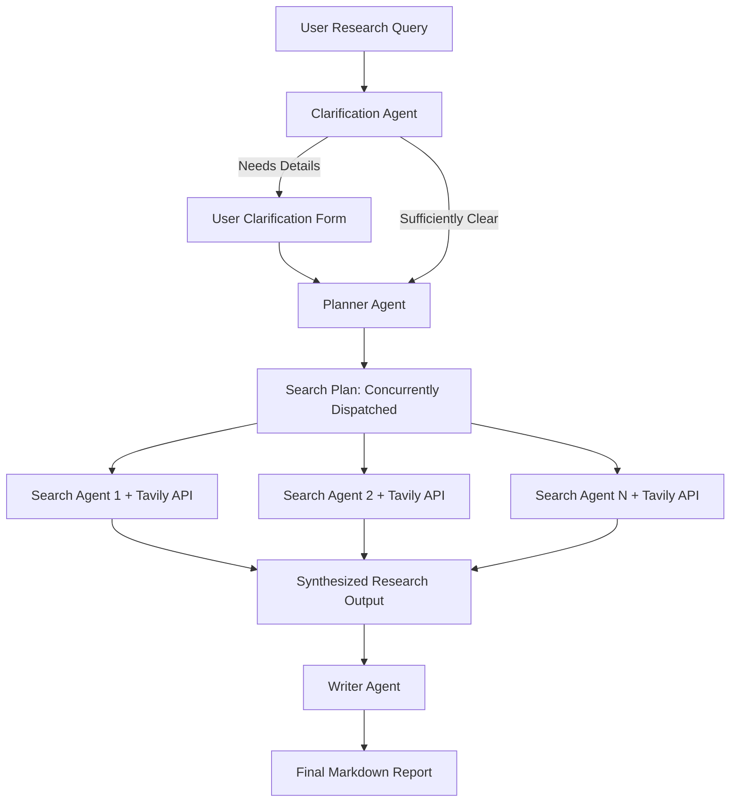

# 🔍 Deep / Research
### *Multi-Search Autonomous Investigation & AI Agent Engine*

**Deep / Research** is an advanced, multi-agent AI research system designed to perform autonomous web-scale investigations. Built on the **OpenAI Agents SDK**, powered by **DeepSeek-V4 (via OpenRouter)** and **Tavily Search API**, and packaged in a sleek **Obsidian Glassmorphism Gradio UI**, it transforms any research query into a comprehensive, publication-ready intelligence report.

---

## ✨ Features

- **🤖 Multi-Agent Autonomous Orchestration**:
  - **Clarification Agent**: Evaluates technical scope & domain gaps before research begins.
  - **Planner Agent**: Deconstructs queries into targeted, parallel web search strategies.
  - **Search Agent**: Executes real-time web searches and synthesizes key insights.
  - **Writer Agent**: Compiles findings into comprehensive markdown reports.
  - **Research Manager**: Coordinates concurrent async task execution and live status streaming.
- **⚡ Smart Execution Flow**: Automatically detects whether query clarification is needed. If clear, it launches deep research directly without unnecessary manual clicks.
- **🔍 Concurrent Tavily Web Search**: Executes multiple search queries in parallel with full error resilience (`return_exceptions=True`).
- **🎨 Obsidian Glassmorphism UI**: High-contrast dark theme with animated glowing progress cards, smooth auto-scroll, and mobile-responsive layouts.

---

## 🛠️ Architecture Workflow



---

## 📂 Project Structure

```
deep_research/
├── app.py                   # Main Gradio application interface & streaming event handlers
├── research_manager.py      # Async pipeline manager coordinating agent workflows
├── planner_agent.py         # Breaks down user query into a multi-query search plan
├── search_agent.py          # Executes web searches via Tavily & synthesizes summaries
├── clarification_agent.py   # Analyzes query clarity & recommends follow-up questions
├── writer_agent.py          # Synthesizes research into a structured markdown report
├── styles.py                # Modern obsidian design system, CSS animations & JS auto-scroll
├── requirements.txt         # Project dependencies
└── README.md                # Documentation
```

---

## 🚀 Quickstart Guide

### 1. Prerequisites
- Python 3.10 or higher
- An OpenRouter API Key (for DeepSeek model access)
- A Tavily API Key (for real-time web search)

### 2. Environment Setup
Create a `.env` file in the root directory (or parent workspace directory):

```env
OPENROUTER_API_KEY=your_openrouter_api_key_here
GOOGLE_API_KEY=your_google_api_key_here
TVLY_API_KEY=your_tavily_api_key_here
```

### 3. Installation
Install the required dependencies:

```bash
pip install -r requirements.txt
```

### 4. Run the Application
Start the Gradio web interface:

```bash
python app.py
```
### 5. Demo Link
https://deep-research-agent-wo6o.onrender.com/
